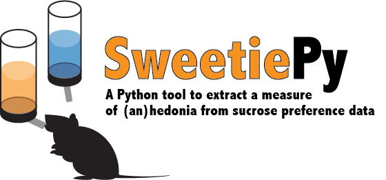

# SweetiePy

Written by Dr. Jeroen P.H. Verharen, UC Berkeley. The paper accompanying this toolbox is currently undergoing peer review (for preprint click <url="https://www.biorxiv.org/content/10.1101/2022.11.30.518425v1">here</url>).

For questions: jeroenverharen@gmail.com

## Sucrose preference test :mouse:

The sucrose preference test is one of the most widely used behavioral paradigms in neuroscience, measuring the relative preference of a 1-2% sucrose solution over water as a proxy for reward sensitivity in rodents. As such, a reduction in sucrose preference is interpreted as anhedonia, and used as evidence that animals exhibit ‘depression-like behavior’, for example after stress.

However, the sucrose preference test is a surprisingly complex behavioral test that involves several additional cognitive processes, including learning and memory. As a result, a mere reduction in sucrose preference can also be indicative an inability of animals to learn from or memorize reward, and thus does not necessarily reflect anhedonia.

## Model fitting procedure

In an attempt to parse the different component processes subserving sucrose preference, we used a model fitting procedure in which we fit 14 different reinforcement learning models to the trial-by-trial choice behavior of mice in the sucrose preference test. These 14 models differed in the way animals attributed value to the water and sucrose bottles in the task (learning), how those values guided choices, and how the value of the unchosen bottle changed over time. 

The winning model was one that described behavior of the animals on the basis of three free parameters:

1. hedonia parameter ρ, indicating the extent to which sucrose is valued over water (ρ > 1, sucrose valued over water; ρ < 1, water valued over sucrose)
2. learning rate α, measuring the extent to which a single choice affects bottle value (α = 0, no learning; α = 1, absolute learning)
3. discount/attraction parameter η, indicating whether not choosing a certain bottle will decrease (discounting of value; η < 0) or increase (attraction to unchosen bottle, η > 0) the value of that unchosen bottle

The winning model was further described by a choice size-dependent choice rule, meaning that learning was stronger for choices with more licks, and by choice behavior according to a Softmax equation (with inverse temperature β set at 1). 

For each session, best-fit parameters {ρ, α, η} were estimated using maximum likelihood estimation, allowing for a point-estimate comparison of each of the parameters between different mice and SPT sessions. See how this works in this video:

https://user-images.githubusercontent.com/31282220/186237978-95647e80-19ae-420c-90cd-f8bbc32d82dc.mp4

## The SweetiePy toolbox

The SweetiePy toolbox consists of a Jupyter notebook (<code>Main.ipynb</code>) that guides you through the model fitting procedure in a step-by-step manner. The scripts fit model #4 (the winning model in the image above) to your sucrose preference test data. The only data you need to feed the algorithm is the individual timestamps of the licks in the task (in seconds). It will output the values of the parameters in the model (ρ, α and η; see above) that best describe your data. It will also give you the _log likelihood_ of the fit, which describes how well the model describes your data (with a less negative number indicating a better fit). The file <code>SweetiePy.py</code> contains the individual scripts that the Jupyter notebook calls to perform the model fitting procedure.
